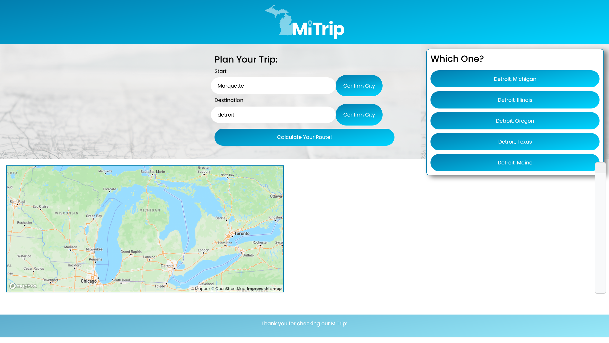
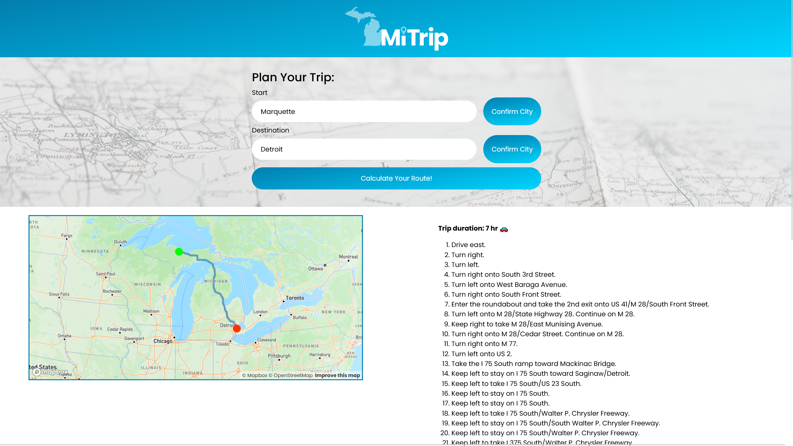
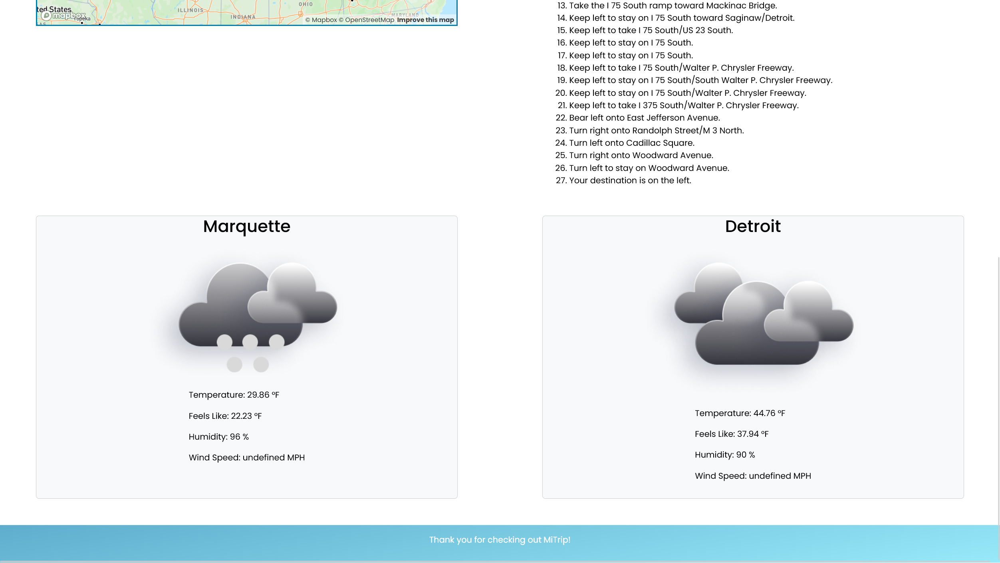

# MiTrip

## Description

This web application is intended to provide driving direction within the continental US as well as showing the current weather conditions in both the starting and destination city. 

Commonly these two features require different web applciations, however we've combined them for ease of use. 

## Installation

There are no installation requirments for this web applciation.

## Usage

https://jacob-jeffries.github.io/MiTrip/

1. To use the MiTrip web app, simply type in the name of your starting city, press [CONFIRM CITY] and select the city from the on screen options. 

2. Next, type in your destination city, click on [CONFIRM CITY], select the city from the on screen options. 

3. Once both cities have been confirmed, click on the [CALCULATE YOUR ROUTE!] button to see the map updated with your route. An estimation of the duration of your trip along with turn-by-turn directions will be displayed. Finally, the current weather conditions for both cities will be displayed.

## Credits

* Jacob Jeffries
* Tony Trocino
* Chris Nagridge

We utilized the OpenWeather API, MapBox API, Jquery, and Bootstrap.  

## License

MIT License

Copyright (c) 2023 Jacob-Jeffries, Tony Trocino, Chris Nagridge

Permission is hereby granted, free of charge, to any person obtaining a copy
of this software and associated documentation files (the "Software"), to deal
in the Software without restriction, including without limitation the rights
to use, copy, modify, merge, publish, distribute, sublicense, and/or sell
copies of the Software, and to permit persons to whom the Software is
furnished to do so, subject to the following conditions:

The above copyright notice and this permission notice shall be included in all
copies or substantial portions of the Software.

THE SOFTWARE IS PROVIDED "AS IS", WITHOUT WARRANTY OF ANY KIND, EXPRESS OR
IMPLIED, INCLUDING BUT NOT LIMITED TO THE WARRANTIES OF MERCHANTABILITY,
FITNESS FOR A PARTICULAR PURPOSE AND NONINFRINGEMENT. IN NO EVENT SHALL THE
AUTHORS OR COPYRIGHT HOLDERS BE LIABLE FOR ANY CLAIM, DAMAGES OR OTHER
LIABILITY, WHETHER IN AN ACTION OF CONTRACT, TORT OR OTHERWISE, ARISING FROM,
OUT OF OR IN CONNECTION WITH THE SOFTWARE OR THE USE OR OTHER DEALINGS IN THE
SOFTWARE.